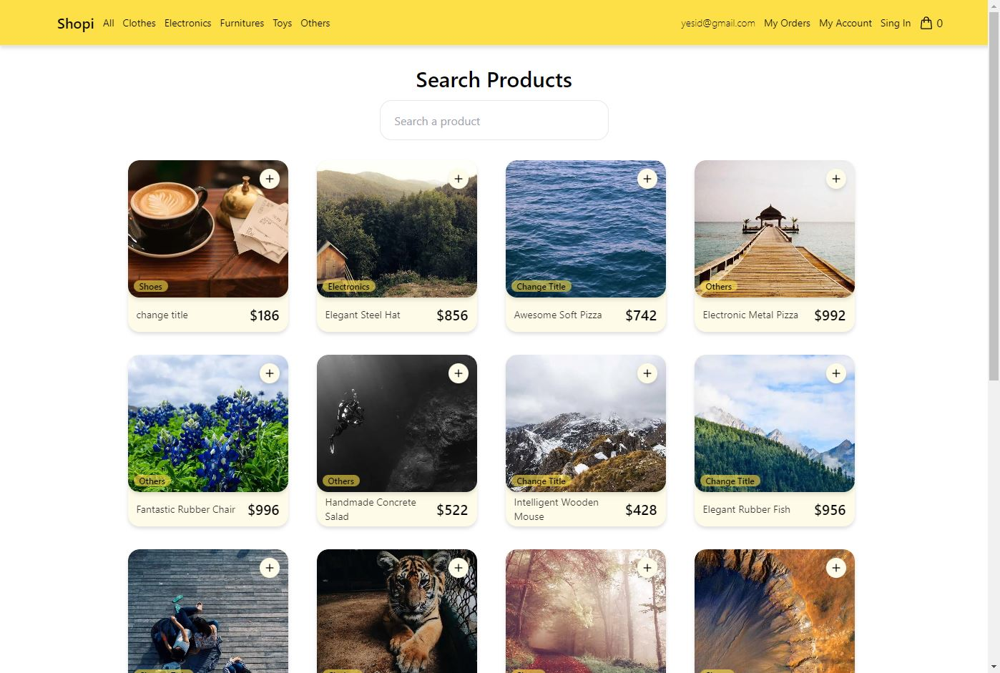

# E-Commerce

Este E-commerce lo hice con la finalidad de practicar con Nextjs 13, es mi primer proyecto de Nextjs por lo que de principio puede tener sus fallas o malas practicas pero la idea es ir mejorandolo constantemente, me apoyé en el curso de [Midu de Nextjs](https://youtu.be/tA-_vAz9y78) para saber lo básico de Next, y un curso de [Platzi](https://platzi.com/cursos/react-vite-tailwindcss/) donde hacen lo mismo pero con React Router DOM, la app seguirá en constante desarrollo, irá mejorando en lo que vaya mejorando mi aprendizaje.
Por ahora lo que puedes hacer es ver los productos y sus categorias, ver el detalle, agregar al carrito, hacer el checkout, ver las ordenes, y ver la orden individual.
> 👷‍♂️ Sigue en desarrollo constante, está al dia con el curso de platzi, solo faltan mejoras a nivel personal además del responsive layout.
> 

## Live demo

> [Acá está, igual anda en constante actualización](https://e-commerce-platzi-h1lkxzhe9-yesidexe.vercel.app/)
> 

## **Tecnologias/recursos**

- [React 18](https://react.dev/)
- [Nextjs 13](https://nextjs.org/blog/next-13)
- [Tailwind CSS](https://tailwindcss.com/)
- [Heroicons](https://heroicons.com/) (icon library)
- [Platzi fake store API](https://fakeapi.platzi.com/)

## Caracteristicas

- [ ]  Responsive layout (mobile/tablet/desktop)
- [x]  useContext
- [ ]  Local Storage
- [ ]  Estados de Loading, Error y vacio.
- [ ]  Poner un border bottom cuando la ruta está activa

## Imagen del proyecto

